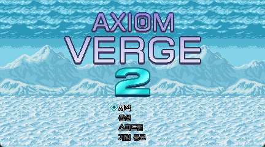
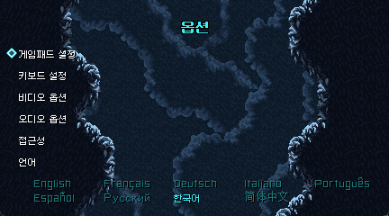
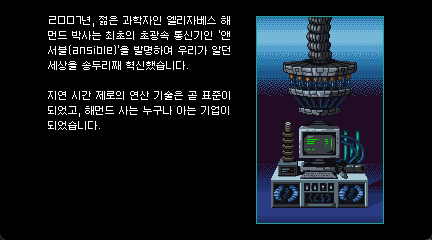
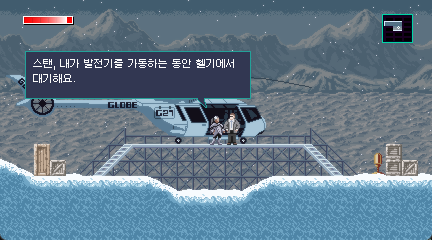
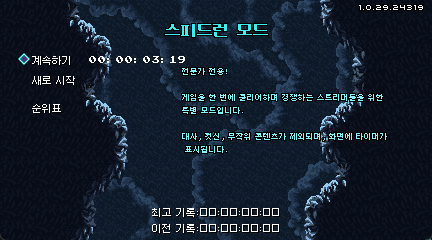

# Axiom Verge 2 한국어 패처 (AV2Patcher)

**Axiom Verge 2**의 한국어 번역 패치 제작 및 적용을 위한 도구 모음입니다.  
본 프로젝트는 개발자용 GUI 툴(`AV2Patcher.Tool`)과 최종 사용자용 원클릭 패처(`AV2Patcher.Patcher`)로 구성되어 있습니다.

## 스크린샷

### 타이틀 화면


### 옵션 설정


### 프롤로그 및 대사




### 스피드런 설명


---

## 주요 기능

### 1. 개발자 도구 (`AV2Patcher.Tool`)
- 게임 실행파일(`AxiomVerge2.exe`)에 번역된 CSV 주입
- 한국어 비트맵 폰트(`.fnt` / `.png`)로 게임 폰트 XNB 교체
  - **원본 병합 (Append)** — 원본 글자를 유지하고 한국어 글리프 추가
  - **완전 대체 (Replace)** — 원본 글자 전부를 커스텀 폰트로 교체
- 폰트 슬롯별 커스텀 폰트 지정 및 미리보기, Y/X 오프셋·자간 미세 조정
- 내장 번역 편집기(Translation Editor) 지원
- **원클릭 패처 제작 (`🔨 Build Patcher`)**: .NET SDK 없이 실행 가능한 Windows 및 Linux용 무설치 원클릭 패처 자동 생성 (바이너리 오버레이 주입 방식)

### 2. 배포용 원클릭 패처 (`AV2Patcher.Patcher`)
- 최종 사용자를 위한 경량 콘솔 기반 원클릭 설치 도구 (Windows 및 Linux/SteamOS 지원)
- **무설치 단일 파일**: 다운로드 후 실행하면 패처 바이너리에 주입된 폰트 파일들을 게임 폴더에 자동으로 추출/설치하고 실행 파일에 패치를 주입합니다.

---

## 지원 폰트 슬롯

| XNB 파일 | 용도 |
|----------|------|
| `Uni0553_6pt.xnb` | 스피드런 설명 텍스트 (6pt) |
| `Hooge0655_8pt.xnb` | 소형 UI / 표준 다이얼로그 (8pt) |
| `NotoSansMonoCJKJpRegular12pt.xnb` | 메인 대화 / 해킹 UI (12pt) |
| `NotoSansMonoCJKJpRegular16pt.xnb` | 대형 텍스트 / 메뉴 제목 (16pt) |

---

## 사용법

### 1. 한글 패치 배포판 만들기 (제작자용)

1. **`AV2Patcher.Tool.exe`** 실행
2. **EXE 경로**에 원본 `AxiomVerge2.exe` 선택 후 `Extract Resources` 클릭
3. `Translations/` 폴더의 CSV 번역 내용 수정 및 번역 편집기 이용
4. 각 폰트 슬롯에서 원하는 한국어 폰트 선택 후 `Build` 클릭해 폰트 컴파일
5. **`Apply Patch`** 클릭 (이 단계에서 번역본과 폰트들이 패키징용 임시 캐시 폴더에 자동 동기화됨)
6. **`🔨 Build Patcher`** 클릭
7. `Release/Windows/` 및 `Release/Linux/` 폴더에 생성된 **`AV2Patcher.Patcher` 단일 실행 파일**을 사용자에게 배포

### 2. 한글 패치 적용하기 (일반 사용자용)

#### Windows
1. 배포받은 **`AV2Patcher.Patcher.exe`** 실행
2. 안내창에서 `Y` 입력 후 엔터
3. 패치 완료 후 게임 실행 (자동 백업 파일 `.origin` 생성됨)

#### Linux (SteamOS / Steam Deck)
1. 배포받은 **`AV2Patcher.Patcher`** 바이너리 다운로드
2. 실행 권한 부여 후 터미널에서 실행:
   ```bash
   chmod +x AV2Patcher.Patcher
   ./AV2Patcher.Patcher
   ```
3. 안내창에서 `Y` 입력 후 엔터

---

## 프로젝트 구조

```
AxiomVerge2KoreanPatcher/
├── AxiomVerge2KoreanPatcher.sln
├── src/
│   ├── AV2Patcher.Tool/            # WPF 개발자 도구 소스
│   │   ├── Core/
│   │   │   ├── Config.cs           # 설정 및 폰트 매핑
│   │   │   └── FontBuilder.cs      # XNB 빌드 / 언팩
│   │   ├── MainWindow.xaml(.cs)
│   │   └── AV2Patcher.Tool.csproj
│   └── AV2Patcher.Patcher/         # 원클릭 패처 소스 (C# Console)
└── resources/                      # 빌드 리소스
    ├── Fonts/
    │   └── Korean/                 # 커스텀 한국어 폰트 (.fnt + .png)
    ├── Templates/                  # 무설치 오버레이용 빈 패처 템플릿 (Windows/Linux)
    ├── Tools/                      # xnbcli (XNB 빌드 도구)
    └── Translations/               # 번역 CSV
```

---

## 개발 환경 설정

```bash
git clone https://github.com/See1Studios/AxiomVerge2KoreanPatcher.git
cd AxiomVerge2KoreanPatcher
# 개발자 GUI 툴 빌드
dotnet build src/AV2Patcher.Tool/AV2Patcher.Tool.csproj -c Release
```

**요구사항**: .NET 10 SDK, Windows (WPF 빌드용)

---

## 라이선스

[MIT License](LICENSE)
